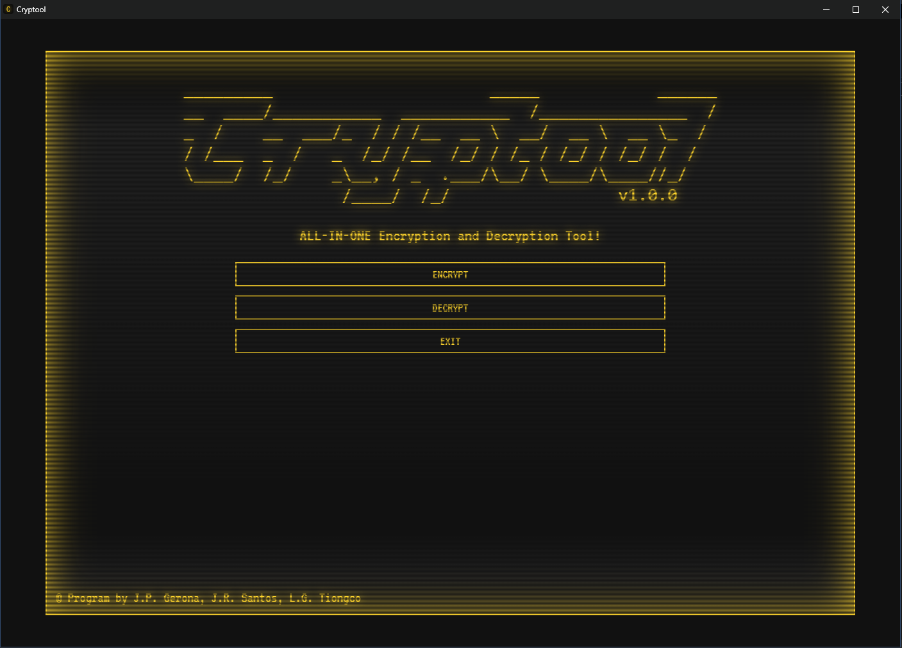

# Cryptool

This project serves as our IT129 requirement.

<div align="center">



</div>

## Tech Stack

<div align="center">


</div>

## Project Structure:

```text
/
├── logic/
│   ├── ciphers.py
│   ├── main.py
├── web/
│   ├── index.html
│   ├── index.css
│   ├── index.js
│   ├── utils/
│   │   ├── actionUtils.js
│   │   ├── viewUtils.js
```

Built with Javascript as frontend and Python as backend.

Powered by [Eel](https://github.com/python-eel/Eel), a Python library for making simple GUI apps.

## Development

Ensure that your current directory is at the logic folder of the project.

```shell
cryptool> cd ./logic
cryptool\logic> py main.py
```

## Build

Ensure that you have PyInstaller installed.

```shell
cryptool> py -m pip install PyInstaller
```

Ensure that your current directory is at the root of the project.

```shell
cryptool> py -m eel ./logic/main.py web --noconsole --onefile
```

## Developers:

- Gerona, Julian Peter
- Santos, John Robert
- Tiongco, Luis Gerard
